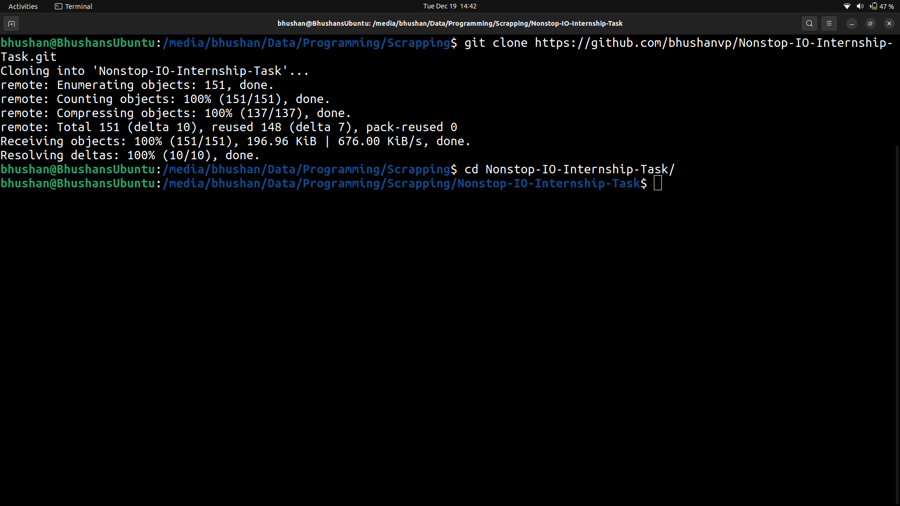
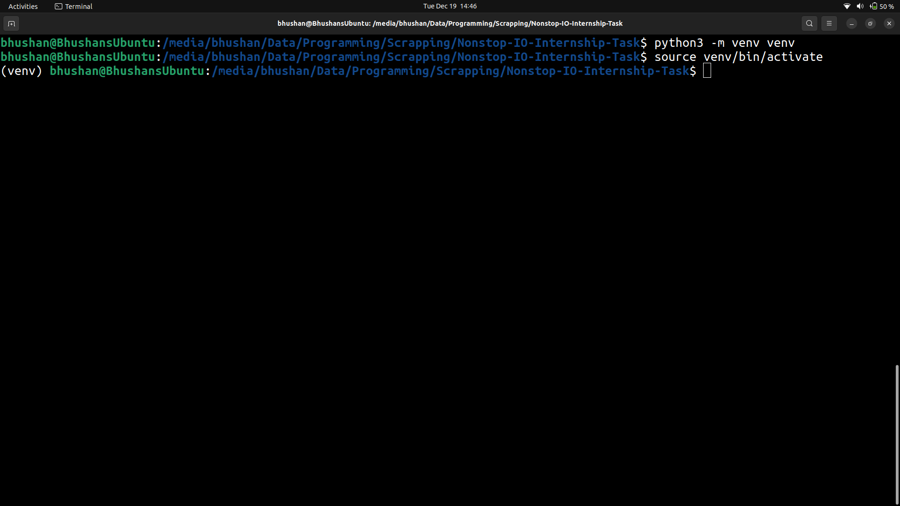
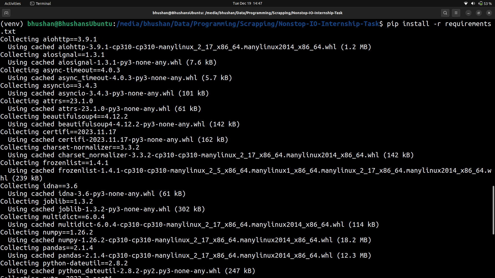
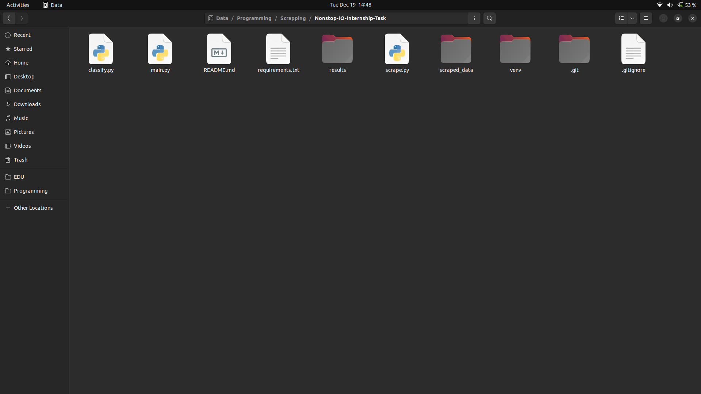
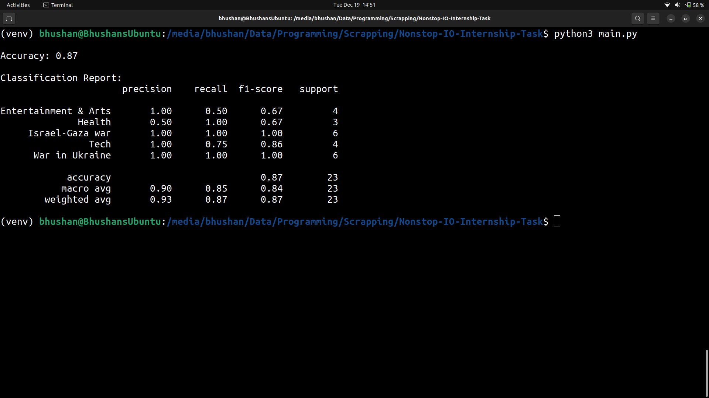

# Article Scrapper and Classifier

## Overview

This project aims to scrape and classify articles from the [BBC News website](https://www.bbc.com/news). It involves web scraping to collect article data and applying a machine learning model (Naive Bayes) to classify articles into different sections.

## Features

* Web Scraping: Utilizes aiohttp and BeautifulSoup for asynchronous web scraping of article content.
* Data Classification: Implements a Naive Bayes classifier using scikit-learn to categorize articles into predefined sections.
* Results Analysis: Generates a results CSV file with predicted and actual labels for further analysis.
* Folder Structure
    + main.py: Actual project file which contains all the code.
    + scrape.py: Contains the part of code responsible for scrapping.
    + classify.py: Contains the part of code responsible for classification
    + scraped_data/: Contains scraped articles saved as text files.
    + results/: Stores result files, including the CSV file with predicted and actual labels.
    + screenshots/: Includes screenshots for the README.

## Installation

### 1. Clone the Repository

Open a terminal and hit the following commands to clone this repo
```bash
git clone https://github.com/bhushanvp/Nonstop-IO-Internship-Task.git
cd Nonstop-IO-Internship-Task
```



### 2. Create a virtual environment

```python
python3 -m venv venv
source venv/bin/activate  # On Windows, use `venv\Scripts\activate`
```



### 3. Install Requirements

```bash
pip install -r requirements.txt
```




### 4. Run the project

```bash
python3 main.py
```

